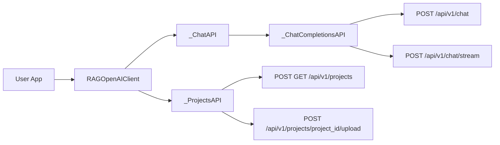
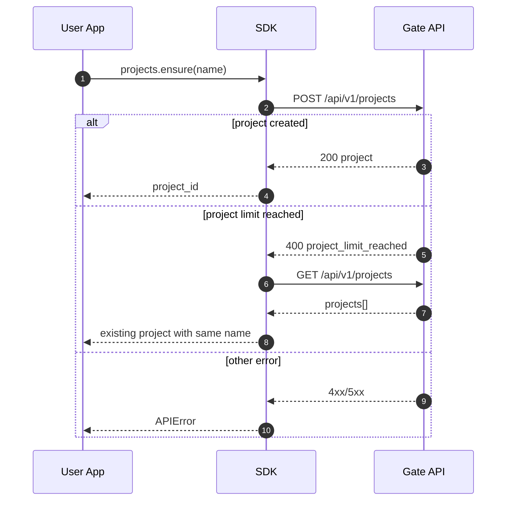
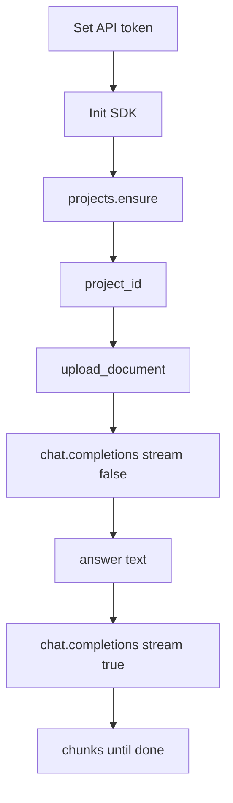

# SDK Diagrams

This document contains Mermaid diagrams for the `client/` SDK.

## Architecture

```mermaid
flowchart LR
  A[User App] --> B[RAGOpenAIClient]
  B --> C[_ProjectsAPI]
  B --> D[_ChatAPI]
  D --> E[_ChatCompletionsAPI]
  C --> F[POST GET /api/v1/projects]
  C --> G[POST /api/v1/projects/project_id/upload]
  E --> H[POST /api/v1/chat]
  E --> I[POST /api/v1/chat/stream]
```

## Ensure Project Flow

```mermaid
sequenceDiagram
  autonumber
  participant U as User App
  participant S as SDK
  participant G as Gate API

  U->>S: projects.ensure(name)
  S->>G: POST /api/v1/projects
  alt project created
    G-->>S: 200 project
    S-->>U: project_id
  else project limit reached
    G-->>S: 400 project_limit_reached
    S->>G: GET /api/v1/projects
    G-->>S: projects[]
    S-->>U: existing project with same name
  else other error
    G-->>S: 4xx/5xx
    S-->>U: APIError
  end
```

## End-to-End

```mermaid
flowchart TD
  A[Set API token] --> B[Init SDK]
  B --> C[projects.ensure]
  C --> D[project_id]
  D --> E[upload_document]
  E --> F[chat.completions stream false]
  F --> G[answer text]
  G --> H[chat.completions stream true]
  H --> I[chunks until done]
```
